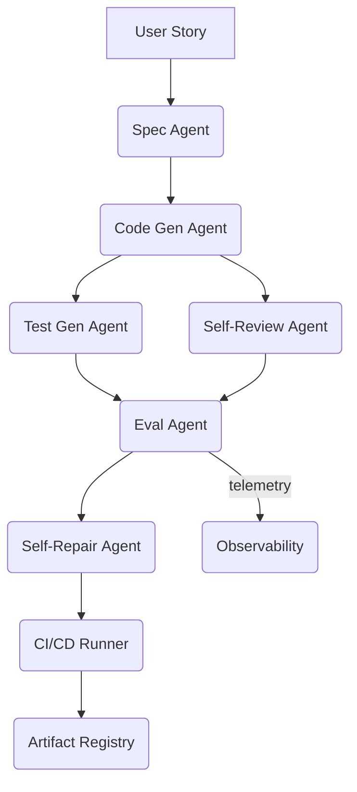

# Autonomous Software Generation Agent – Technical Specification

> **Version**: 1.0 – July 8 2025  
> **Author**: Serhii Shyman

---


## 0. Highlights
	•	Self-Refine loop for iterative quality gains  .
	•	Built-in Guardrails AI validator against prompt-injection  .
	•	TruLens RAG-Triad evaluation block for retrieval apps  .
	•	OpenAI Evals harness for generic pass/fail gating  .
	•	MuTAP-style unit-test synthesis and TESTEVAL benchmark alignment   .
	•	Phare safety audit step to catch hallucinations and bias  .
	•	Hypothesis property-based test generator pattern  .
	•	Additional references on self-consistency reasoning, open-source guardrails, and recent security findings  

## 1 · Purpose

Design an **autonomous agent system** that can ingest a high‑level feature request and produce production‑ready software artifacts—source code, tests, evaluation reports, and deployment manifests—while continuously validating itself with *self‑review* and *LLM‑as‑judge* loops. The goal is to cut cycle time from idea to mergeable pull‑request to **\< 10 minutes** in CI.

## 2 · Goals & Non‑Goals

| Goals | Non‑Goals |
|-------|-----------|
| End‑to‑end automation: spec → code → tests → CI pass | Training foundation LLMs from scratch |
| Pluggable prompts (“prompt pack”) & evaluation suites | Managing human review workflows |
| Language/runtime agnostic (start with Python + TS) | Replacing existing static linters/formatters |

## 3 · System Context



### Key External Services
* **Guardrails AI** – schema & policy validation [^1]  
* **TruLens** – RAG Triad metrics [^2]  
* **OpenAI Evals** – generic pass/fail harness [^3]

## 4 · Component Specifications

### 4.1 Orchestrator (Agent Controller)
* **Pattern**: Event‑driven state machine (Temporal.io workflow)
* **Responsibilities**
  * Persist feature request → job record
  * Dispatch to downstream agents in sequence / parallel
  * Short‑circuit on failure signals

### 4.2 Prompt Strategy Service
* Stores versioned prompt templates (Markdown) and few‑shot examples.
* Exposes `GET /prompt/{name}?v=` for agents.

### 4.3 Spec Agent
* **Input**: user story
* **Output**: JSON spec (endpoint, schemas, acceptance criteria)
* **Prompt**: *Section 2 – Spec & contract draft* from Prompt Pack
* **Validation**: Guardrails JSON‑Schema + prompt‑injection check

### 4.4 Self‑Review Agent
* Runs *Section 3 – Self‑review prompt* iteratively until `delta < ε` or `N=3`.

### 4.5 Code Generation Agent
* Generates minimal runnable code under `/generated/`.
* Uses repository tree + coding conventions as context.
* Adds TODO stubs for business logic.

### 4.6 Test Generation Agent
* Creates:
  * **Unit tests** via MuTAP pattern [^4]
  * **Property tests** via Hypothesis [^7]
* Stores tests under `/generated/tests/`.

### 4.7 Evaluation Agent
* Runs:
  * `pytest --cov`
  * **TruLens** RAG Triad (if RAG app) [^2]
  * **OpenAI Evals** suites [^3]
  * **Phare** safety benchmark [^6]

### 4.8 Self‑Repair Agent
* If any evaluation score < threshold, prompts for diff‑based patch limited to `/generated/`.
* Retries up to 2×.

### 4.9 CI/CD Runner
* GitHub Actions composite action orchestrating all steps.
* Failing badge blocks merge.

### 4.10 Artifact Registry
* Stores versioned specs, code, test reports.
* Implemented via S3‑compatible object store + DynamoDB index.

### 4.11 Observability Stack
* **OpenTelemetry** traces for every agent run.
* Grafana dashboards with latency, cost, pass‑rate KPIs.

### 4.12 Security & Compliance
* Guardrails *prompt‑injection* validators [^1]  
* Rego policies to restrict external calls.
* SBOM generated by `syft`.

## 5 · Data Contracts

```text
Spec.v1
├─ endpoint: string
├─ method: enum
├─ request_schema: JSON‑Schema
└─ response_schema: JSON‑Schema
```

All agent interfaces exchange **JSON over gRPC**; protobuf definitions live under `/proto`.

## 6 · Deployment Topology

| Component        | Runtime | Scaling | Notes |
|------------------|---------|---------|-------|
| Agents           | Docker  | KEDA (CPU + queue length) | |
| Orchestrator     | Temporal Cloud |  | resiliency |
| Vector DB (RAG)  | Qdrant | 3 replicas | |
| Artifact Store   | MinIO   | HA      | |

## 7 · CI Workflow Example

```yaml
name: agent-pipeline
on: [pull_request]
jobs:
  run:
    uses: ./.github/workflows/auto_agent.yml
```

Inside `auto_agent.yml`:

1. Checkout  
2. `pip install guardrails-ai trulens`  
3. `python -m agent_runner --job ${{ github.sha }}`

## 8 · Extensibility

* Plug‑in language adapters via *Strategy* pattern.
* Add new evaluation suites by dropping YAML into `/evals/`.
* Swap model provider via config file.

## 9 · Reference Prompts

See **docs/prompts.md** (bundled separately) for 12 canonical prompts covering ideation → bias audit.


## 10 · Engineering Principles

| ID | Principle | Enforcement |
|----|-----------|-------------|
| P1 | **Spec → Tests → Code** | Every task provides failing tests first. CI gate rejects PRs without new or updated tests. |
| P2 | **Prompt Modularity** | Prompts split into _signature_, _policy_, _evaluation_; each < 300 tokens. |
| P3 | **Determinism** | All helpers are pure functions; external IO wrapped behind adapters with injectable fakes. |
| P4 | **Shallow Call‑Stacks** | Function call depth ≤ 2. Lint rule `flake8‑max‑complexity` enforced. |
| P5 | **Budgeted LLM Calls** | `max_tokens`, `temperature`, `top_p`, and `seed` are explicit and surfaced in tests. |
| P6 | **Diffable Artifacts** | Each patch written to `/patches/<hash>.diff`, committed, and snapshot‑tested. |
| P7 | **Human‑in‑the‑Loop** | Critic node emits JSON `{title,summary,diff,evidence}` for PR templates. |

---

## 11 · Repository Layout

```
.
├── README.md          # Developer & operator guide
├── docs/              # Diagrams, ADRs, extra docs
│   ├── prompts.md     # Prompts covering the entire lifecycle
│   ├── spec.md        # Detailed technical specification
├── src/
│   ├── adapters/      # IO boundaries (RAG, telemetry, local‑model)
│   ├── nodes/         # LangGraph node functions
│   ├── planner.py     # DSPy planner signature
│   ├── critic.py      # DSPy critic signature
│   ├── state.py       # RepoState dataclass
│   └── agent.py       # Main agent loop
├── tests/             # PyTest suite
├── Dockerfile
└── .github/
    └── workflows/ci.yml
```

---

## 13 · CI / CD Matrix

| Job | Trigger | Blocking | Notes |
|-----|---------|----------|-------|
| lint‑ruff | PR, push | ✅ | `ruff check --fix` |
| type‑mypy | PR, push | ✅ | `mypy src/` |
| tests | PR, push | ✅ | `pytest -q` |
| black | PR, push | ✅ | `black` |

---

## 14 · Versioning

Follows **SemVer 2.0** – the API is the planner & critic signatures.  Breaking
changes bump **MAJOR**.

---

## 14 · Security

* Bandit and Semgrep executed in pipeline.  
* Dependencies scanned with `pip‑audit`.  